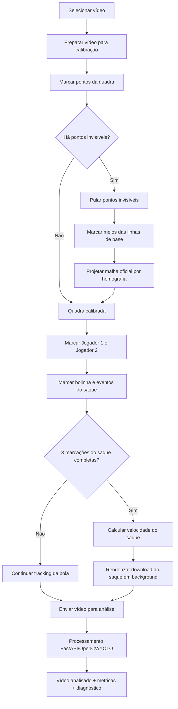
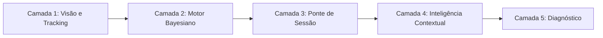

# Tennis X-Ray: relatório técnico, guia de uso e guia de desenvolvimento

O Tennis X-Ray é uma aplicação web local para análise biomecânica de vídeos de tênis. Ela combina um frontend em HTML, CSS e JavaScript puro com um backend FastAPI em Python, OpenCV, NumPy e, quando disponível, YOLO/Ultralytics. O objetivo do sistema é permitir que o usuário carregue um vídeo real, calibre a quadra, marque referências da bola e dos jogadores, processe o vídeo e gere um resultado com boxes, esqueletos, tracking, métricas biomecânicas, velocidade do saque e diagnóstico operacional.

Este README foi escrito como um artigo técnico completo. Ele serve para três públicos ao mesmo tempo:

- Usuários que querem extrair o máximo da ferramenta durante a análise de vídeos.
- Desenvolvedores que querem entender a stack, os módulos, os contratos de API e as decisões de implementação.
- Pesquisadores ou analistas que querem evoluir a aplicação para detecção mais precisa, modelos profissionais de referência, tracking 3D, RF-DETR, pose estimation real e persistência de sessões.

> Aviso importante: o projeto é uma ferramenta técnica de análise visual e biomecânica. Ele não substitui avaliação presencial de treinador, fisioterapeuta, médico ou biomecanicista. As métricas dependem fortemente de qualidade do vídeo, ângulo da câmera, calibração da quadra e marcações manuais.

---

## 1. Visão geral do produto

O fluxo principal da aplicação é:

1. O usuário seleciona um vídeo de tênis.
2. O frontend abre um modal de calibração.
3. O usuário marca pontos oficiais da quadra no frame.
4. Se pontos da quadra não estiverem visíveis, o usuário pode pulá-los.
5. Quando necessário, o sistema pede os meios das linhas de base para deduzir a malha oficial.
6. O usuário marca os jogadores.
7. O usuário marca a bolinha em múltiplos frames.
8. Para saque, o usuário marca ou confirma: contato com a raquete, projeção no chão e primeiro toque na quadra.
9. O frontend pode calcular a velocidade do saque antes de renderizar o vídeo.
10. O backend processa o vídeo real em segundo plano.
11. A tela exibe o vídeo analisado, métricas, diagnóstico, estado da sessão e série temporal.
12. O usuário pode cancelar jobs em andamento.
13. O usuário pode gerar um download específico do saque com overlay de velocidade.

Fluxo resumido:



---

## 2. Stack utilizada

### 2.1 Backend

O backend fica em `backend/app` e usa:

- **FastAPI**: criação dos endpoints REST, upload de arquivos, resposta JSON, arquivos estáticos e documentação automática em `/docs`.
- **Pydantic**: modelos de dados tipados em `backend/app/modelos.py`.
- **OpenCV (`cv2`)**: leitura de vídeos, extração de frames, desenho de overlays, detecção heurística de bola/jogador, Hough Circle, máscaras HSV, transcodificação inicial via `VideoWriter`.
- **NumPy**: cálculos matriciais, amostragem, homografia, interpolação e estatísticas.
- **imageio-ffmpeg**: obtenção de binário FFmpeg para converter MP4 bruto em H.264 compatível com navegador.
- **Ultralytics/YOLO** opcional: detecção de pessoas quando `yolov8n.pt` ou outro peso está disponível.

Dependências mínimas:

```txt
fastapi>=0.115.0
uvicorn[standard]>=0.32.0
numpy>=2.1.0
python-multipart>=0.0.12
opencv-python>=4.10.0
imageio-ffmpeg>=0.6.0
```

Dependências pesadas/opcionais de visão:

```txt
ultralytics>=8.3.0
torch>=2.5.0
torchvision>=0.20.0
opencv-python>=4.10.0
scipy>=1.14.0
pandas>=2.2.0
```

### 2.2 Frontend

O frontend fica em `web` e usa:

- **HTML estático** em `web/index.html`.
- **CSS puro** em `web/assets/estilos.css`.
- **JavaScript puro** em `web/assets/app.js`.
- **SVG** para renderizar quadra, miniquadra, timeline e overlays do painel demo.
- **Canvas + SVG overlay** no modal de calibração, permitindo zoom, pan, pontos fixos e guias tracejadas.
- **Fetch API** para comunicação com o backend.

Não há React, Vue, Vite, Webpack ou bundler. Isso torna a aplicação simples de executar localmente, mas exige disciplina ao organizar o `app.js`, pois ele concentra muito estado e muitas funções.

### 2.3 Arquitetura de diretórios

```text
tennis-xray/
├── backend/
│   └── app/
│       ├── api/
│       │   └── rotas_analise.py
│       ├── servicos/
│       │   ├── camada_visao.py
│       │   ├── inteligencia_contextual.py
│       │   ├── motor_bayesiano.py
│       │   ├── motor_diagnostico.py
│       │   ├── orquestrador.py
│       │   ├── ponte_sessao.py
│       │   └── visao_video_real.py
│       ├── main.py
│       └── modelos.py
├── uploads/
│   ├── calibration/
│   └── processed/
├── web/
│   ├── assets/
│   │   ├── app.js
│   │   └── estilos.css
│   └── index.html
├── requirements.txt
├── requirements-visao.txt
├── start_app.bat
├── yolov8n.pt
└── README.md
```

---

## 3. Como executar localmente

### 3.1 Execução recomendada no Windows

Use o script:

```bat
start_app.bat
```

Por padrão ele sobe a aplicação em:

```text
http://127.0.0.1:8000/
```

Também é possível escolher porta:

```bat
start_app.bat 8010
```

Ou iniciar sem abrir navegador:

```bat
start_app.bat 8000 --no-browser
```

O script faz:

1. Localiza Python.
2. Cria `.venv` se necessário.
3. Garante `uploads/` e `.tmp/`.
4. Instala dependências mínimas se faltarem.
5. Inicia `uvicorn backend.app.main:app --reload`.

### 3.2 Execução manual

```powershell
python -m venv .venv
.venv\Scripts\activate
pip install -r requirements.txt
uvicorn backend.app.main:app --reload --host 127.0.0.1 --port 8000
```

Para instalar a pilha pesada de visão:

```powershell
pip install -r requirements-visao.txt
```

---

## 4. Arquitetura de negócio em cinco camadas

A aplicação nasceu inspirada em arquiteturas de visão computacional com camadas, mas foi adaptada para biomecânica de tênis.



### 4.1 Camada 1: Visão e Tracking

Responsável por:

- Detectar jogadores.
- Detectar bolinha.
- Montar boxes.
- Gerar esqueletos estimados.
- Converter coordenadas normalizadas para metros quando há calibração.
- Desenhar overlay do vídeo processado.
- Calcular métricas básicas do movimento.

Existem dois modos:

- **Demo sintético** em `camada_visao.py`: gera quadros determinísticos para demonstrar UI e camadas.
- **Vídeo real** em `visao_video_real.py`: lê frames do upload, usa YOLO/OpenCV, calibração manual e renderiza MP4 anotado.

### 4.2 Camada 2: Motor Bayesiano

Arquivo: `backend/app/servicos/motor_bayesiano.py`.

No modo demo, o motor considera quadros consistentes quando:

```python
atleta.indice_estabilidade >= 0.74
and atleta.indice_simetria >= 0.78
and 118 <= atleta.flexao_joelho_graus <= 160
```

Ele usa uma distribuição Beta:

```python
alpha_p1 = alpha_inicial + consistentes_p1
beta_p1 = beta_inicial + (total - consistentes_p1)
amostras_p1 = rng.beta(alpha_p1, beta_p1, size=simulacoes)
```

Parâmetros importantes:

| Parâmetro | Padrão | Significado | Se aumentar | Se diminuir |
|---|---:|---|---|---|
| `alpha_inicial` | `18.0` | Força inicial positiva da crença de movimento consistente | O modelo começa mais otimista | O modelo fica mais sensível a falhas |
| `beta_inicial` | `7.0` | Força inicial negativa | O modelo começa mais conservador | O modelo confia mais cedo nas observações |
| `simulacoes` | `6000` | Amostras Monte Carlo da posterior | Intervalos mais estáveis, mais CPU | Mais rápido, mais ruído |
| `semente` | `42` | Reprodutibilidade | Muda a sequência estatística | Mantém resultados determinísticos |

### 4.3 Camada 3: Ponte de Sessão

Arquivo: `backend/app/servicos/ponte_sessao.py`.

Converte frames e métricas em um estado legível para a interface:

- `id_sessao`
- `titulo`
- `superficie`
- `camera`
- `fps`
- `total_quadros`
- `duracao_s`
- `fase_atual`
- `qualidade_calibracao`
- `marcadores_monitorados`

A fase atual é derivada da posição da bola e velocidade média:

```python
if bola.posicao_quadra_m.y < 8:
    return "Preparacao ofensiva"
if bola.posicao_quadra_m.y > 16:
    return "Recuperacao defensiva"
if metricas.velocidade_media_bola_ms > 15:
    return "Troca acelerada"
return "Rali em controle"
```

### 4.4 Camada 4: Inteligência Contextual

Arquivo: `backend/app/servicos/inteligencia_contextual.py`.

Interpreta anotações humanas e converte termos em prioridade clínica e ajuste de confiança. Exemplos:

- `dor`: aumenta prioridade em `0.28`.
- `fadiga`: aumenta prioridade em `0.22`.
- `joelho`: aumenta prioridade em `0.16`.
- `solto`: reduz prioridade em `0.08`.
- `estavel`: reduz prioridade em `0.08`.

Isso não usa LLM externo no estado atual; é uma heurística local baseada em palavras-chave normalizadas.

### 4.5 Camada 5: Motor de Diagnóstico

Arquivo: `backend/app/servicos/motor_diagnostico.py`.

Gera alertas como:

- `ASSIMETRIA`
- `ESTABILIDADE`
- `CONTROLE`

Exemplo de regra:

```python
if estimativa.risco_assimetria_p1 >= 0.28 or metricas.simetria_apoio_p1 < 0.78:
    alertas.append(...)
```

O diagnóstico consolida:

- métricas biomecânicas,
- incerteza bayesiana,
- tracking,
- prioridade contextual,
- recomendações práticas.

---

## 5. Backend FastAPI

### 5.1 Inicialização da aplicação

Arquivo: `backend/app/main.py`.

```python
app = FastAPI(
    title="Plataforma Biomecanica de Tenis",
    version="0.1.0",
)

app.include_router(router)
app.mount("/assets", StaticFiles(directory=WEB_DIR / "assets"), name="assets")
app.mount("/uploads", StaticFiles(directory=UPLOAD_DIR), name="uploads")

@app.get("/", include_in_schema=False)
def raiz():
    return FileResponse(WEB_DIR / "index.html")
```

O backend também serve:

- `/assets/*`: CSS e JS.
- `/uploads/*`: vídeos originais e processados.
- `/docs`: Swagger gerado pelo FastAPI.

### 5.2 Endpoints

| Método | Endpoint | Finalidade |
|---|---|---|
| `GET` | `/api/saude` | Verificar se backend está online |
| `GET` | `/api/arquitetura` | Retornar descrição das cinco camadas |
| `GET` | `/api/painel/demo` | Gerar análise demo sintética |
| `POST` | `/api/inteligencia/analisar-anotacao` | Interpretar anotação textual |
| `POST` | `/api/videos/calibracao/preparar` | Enviar vídeo para extração rápida de frames no modal |
| `GET` | `/api/videos/calibracao/{id}/frame` | Buscar frame JPEG para calibração |
| `POST` | `/api/videos/calibracao/velocidade-saque` | Calcular velocidade do saque sem renderizar vídeo |
| `POST` | `/api/videos/upload` | Criar job de processamento do vídeo real |
| `GET` | `/api/videos/jobs/{job_id}` | Consultar progresso/resultado |
| `POST` | `/api/videos/jobs/{job_id}/finalizar` | Solicitar cancelamento seguro do job |

### 5.3 Exemplo: preparar calibração

```bash
curl -X POST http://127.0.0.1:8000/api/videos/calibracao/preparar \
  -F "arquivo=@saque.mp4"
```

Resposta esperada:

```json
{
  "calibracao_id": "43e15981dfb44557916232b0fff8b931",
  "nome_original": "saque.mp4",
  "tamanho_bytes": 12345678,
  "fps": 60.0,
  "frames_video": 420,
  "duracao_s": 7.0,
  "largura": 1920,
  "altura": 1080
}
```

### 5.4 Exemplo: obter frame de calibração

```bash
curl "http://127.0.0.1:8000/api/videos/calibracao/43e15981dfb44557916232b0fff8b931/frame?tempo_s=1.60&max_width=1280" \
  --output frame.jpg
```

Parâmetros:

| Parâmetro | Padrão | Significado |
|---|---:|---|
| `tempo_s` | `0.0` | Tempo desejado em segundos |
| `max_width` | `1280` | Largura máxima do preview JPEG |

O backend arredonda `tempo_s` para o frame mais próximo:

```python
frame_idx = int(round(max(0.0, tempo_s) * fps))
```

O retorno inclui o header:

```text
X-Frame-Index: 96
```

Esse header é usado no frontend para manter tempo e frame coerentes durante marcações.

### 5.5 Exemplo: calcular velocidade do saque sem renderizar

```bash
curl -X POST http://127.0.0.1:8000/api/videos/calibracao/velocidade-saque \
  -H "Content-Type: application/json" \
  -d @calibracao.json
```

Resposta típica:

```json
{
  "velocidade_saque_status": {
    "ok": true,
    "mensagem": "Velocidade do saque calculada e mapeada para o video analisado.",
    "faltando": [],
    "overlay_mapeado": false
  },
  "velocidade_saque": {
    "velocidade_kmh": 204.0,
    "velocidade_media_voo_kmh": 189.9,
    "fator_radar": 1.074,
    "distancia_m": 15.26,
    "distancia_planta_m": 14.65,
    "distancia_reta_3d_m": 15.10,
    "altura_contato_m": 2.77,
    "altura_primeiro_toque_m": 0.03,
    "tempo_voo_s": 0.269,
    "fps_calculo": 60.0,
    "amostras_usadas": 4,
    "metodo": "trajetoria_3d_segmentada_com_altura",
    "confianca": 0.95
  }
}
```

---

## 6. Modelos de dados

Arquivo: `backend/app/modelos.py`.

Principais modelos:

| Modelo | Papel |
|---|---|
| `Coordenada` | Ponto `x/y`, normalizado ou em metros dependendo do contexto |
| `CaixaDelimitadora` | Box de jogador com `x`, `y`, `largura`, `altura` |
| `MarcadorCorporal` | Ponto corporal com nome, posição e confiança |
| `AtletaQuadro` | Estado de um atleta em um frame |
| `BolaQuadro` | Estado da bola em um frame |
| `PontoQuadra` | Ponto conhecido da quadra no vídeo |
| `QuadroAnalise` | Frame processado com atletas, bola e quadra |
| `MetricasBiomecanicas` | Resumo numérico da janela analisada |
| `EstimativaBayesiana` | Qualidade, risco e incerteza |
| `RelatorioInteligente` | Interpretação contextual |
| `DiagnosticoSessao` | Recomendações e alertas |
| `RespostaPainel` | Payload final consumido pelo frontend |

Exemplo simplificado:

```python
class AtletaQuadro(BaseModel):
    id_atleta: str
    rotulo: str
    caixa: CaixaDelimitadora
    centro_video: Coordenada
    centro_quadra_m: Coordenada
    velocidade_ms: float
    angulo_tronco_graus: float
    flexao_joelho_graus: float
    largura_base_apoio_m: float
    indice_estabilidade: float
    indice_simetria: float
    cobertura_lateral_m: float
    marcadores: list[MarcadorCorporal]
    confianca_tracking: float
```

Influência prática:

- `centro_video` alimenta desenho no SVG/frontend.
- `centro_quadra_m` alimenta métricas em metros.
- `confianca_tracking` influencia qualidade geral.
- `indice_estabilidade` e `indice_simetria` alimentam diagnóstico e motor bayesiano.

---

## 7. Modal de calibração

O modal de calibração é um dos componentes centrais da aplicação. Ele está no HTML em `#modal-calibracao` e sua lógica fica em `web/assets/app.js`.

### 7.1 Por que calibrar?

Sem calibração, o sistema trabalha com pixels e aproximações. Com calibração:

- pixels podem ser convertidos para metros,
- linhas invisíveis podem ser deduzidas,
- a bola pode ser rastreada com anchors,
- jogadores podem ser associados corretamente,
- a velocidade do saque pode usar distância real e altura estimada.

### 7.2 Pontos oficiais da quadra

O frontend define 12 pontos principais:

```js
const PONTOS_QUADRA_CALIBRACAO = [
  { id: "sup_esquerda", label: "Base superior externa - canto esquerdo" },
  { id: "sup_direita", label: "Base superior externa - canto direito" },
  { id: "inf_esquerda", label: "Base inferior externa - canto esquerdo" },
  { id: "inf_direita", label: "Base inferior externa - canto direito" },
  { id: "rede_esquerda", label: "Rede - extremidade esquerda na lateral externa" },
  { id: "rede_direita", label: "Rede - extremidade direita na lateral externa" },
  { id: "servico_sup_esquerda", label: "Servico superior - lateral interna esquerda" },
  { id: "servico_sup_direita", label: "Servico superior - lateral interna direita" },
  { id: "servico_inf_esquerda", label: "Servico inferior - lateral interna esquerda" },
  { id: "servico_inf_direita", label: "Servico inferior - lateral interna direita" },
  { id: "centro_sup", label: "T superior - centro da linha de serviço" },
  { id: "centro_inf", label: "T inferior - centro da linha de serviço" }
];
```

### 7.3 Medidas oficiais usadas

As dimensões usadas no frontend e backend são:

| Medida | Valor |
|---|---:|
| Largura total da quadra | `10.97 m` |
| Largura interna de simples | `8.23 m` |
| Linha de base até linha do T | `5.485 m` |
| Linha do T até rede | `6.4 m` |
| T até linha vertical interna | `4.115 m` |
| Comprimento total calculado | `(5.485 + 6.4) * 2 = 23.77 m` |
| Altura da rede no centro | `0.914 m` |
| Altura da rede nas laterais | `1.07 m` |
| Raio da bola | `0.0335 m` |

### 7.4 Pontos invisíveis e botão "Pular"

Quando uma extremidade ou linha não aparece no frame:

1. Clique em **Pular**.
2. A aplicação marca aquele ponto em `court_missing`.
3. Ao final dos 12 pontos, se houver ponto pulado/faltante, a aplicação entra em `quadra_centros_base`.
4. O usuário marca o meio da linha de base superior e inferior.
5. O sistema usa homografia para projetar os pontos faltantes.

Essa etapa é essencial para vídeos em que as laterais da base estão fora do frame.

### 7.5 Meios das linhas de base

Os pontos auxiliares são:

```js
const PONTOS_CENTRO_BASE_CALIBRACAO = [
  { id: "base_sup_centro", label: "Meio da linha de base superior" },
  { id: "base_inf_centro", label: "Meio da linha de base inferior" }
];
```

Eles ficam no eixo central da quadra, alinhados com `centro_sup` e `centro_inf`. A interface desenha uma linha tracejada usando a direção da linha do T para ajudar a marcar esses pontos.

### 7.6 Homografia no frontend

O frontend monta uma homografia que converte coordenadas normalizadas do vídeo para coordenadas reais da quadra.

A função `matrizHomografiaVideoParaQuadra()` monta um sistema linear com os pontos marcados:

```js
linhas.push([x, y, 1, 0, 0, 0, -xReal * x, -xReal * y]);
respostas.push(xReal);
linhas.push([0, 0, 0, x, y, 1, -yReal * x, -yReal * y]);
respostas.push(yReal);
```

Depois resolve por eliminação Gauss-Jordan:

```js
const solucao = resolverSistemaLinear(normal, rhs);
return solucao ? [...solucao, 1] : null;
```

Interpretação:

- Quanto mais pontos corretos, mais estável fica a homografia.
- Pontos mal marcados podem distorcer metros, velocidade e projeção.
- Pular pontos invisíveis é melhor do que marcá-los "no chute".

### 7.7 Zoom e pan

O modal usa Canvas para o frame e SVG para os pontos. O zoom:

- não altera a coordenada real salva;
- apenas muda visualização;
- mantém marcadores fixos no ponto original;
- permite pan arrastando.

Atalhos:

| Ação | Comando |
|---|---|
| Zoom in | botão `+` ou roda do mouse |
| Zoom out | botão `-` ou roda do mouse |
| Reset zoom | botão reset |
| Avançar frame | seta direita |
| Voltar frame | seta esquerda |
| Salto de tempo maior | `Ctrl + seta` |
| Ao marcar bolinha com Ctrl | próximo frame avança `0.1s` |
| Ao marcar bolinha sem Ctrl | próximo frame avança `0.05s` |

---

## 8. Tracking da bolinha

### 8.1 Marcações recomendadas

O frontend recomenda uma sequência com pelo menos 12 marcações:

```js
[
  "inicio do lancamento",
  "bola subindo",
  "meio da subida",
  "ponto mais alto do saque",
  "bola descendo para contato",
  "pre-contato",
  "contato/bolinha saindo da raquete",
  "primeiros frames apos contato",
  "cruzando a quadra",
  "perto da rede",
  "apos a rede",
  "primeiro toque do saque na quadra",
  "bola proxima ao fundo da quadra",
  "ultimo frame visivel da bola"
]
```

O mínimo exigido pela validação é:

```js
const MIN_MARCACOES_BOLA = 12;
```

### 8.2 Por que marcar muitos pontos?

O detector de bola em vídeo de tênis é difícil porque:

- a bola é pequena,
- há motion blur,
- reflexos podem parecer bolas,
- luzes, placas e artefatos podem ser amarelos,
- a bola pode desaparecer em frames,
- a profundidade muda o tamanho aparente,
- a raquete pode ser confundida com a bola no contato.

As marcações manuais viram anchors:

```python
@dataclass
class BallAnchor:
    tempo_s: float
    x: float
    y: float
```

O backend usa esses anchors para interpolar um `BallPrior`:

```python
x = anterior.x + (atual.x - anterior.x) * alpha
y = anterior.y + (atual.y - anterior.y) * alpha
gate = max(24.0, min(w, h) * 0.025, ...)
```

Isso cria uma região provável da bola. O detector visual só é aceito se estiver coerente com essa região e com a trajetória temporal.

### 8.3 Detector de bola

Arquivo: `backend/app/servicos/visao_video_real.py`.

O detector usa:

- HSV para máscara amarela,
- remoção de glare/reflexo,
- máscara de movimento,
- contornos circulares,
- Hough Circle,
- ROI perto do saque ou do prior,
- filtros contra boxes de jogador,
- validação temporal,
- suavização com prior.

Exemplo de thresholds:

```python
yellow = cv2.inRange(hsv, np.array([18, 58, 95]), np.array([62, 255, 255]))
min_radius = max(3.0, min(w, h) * 0.0026)
max_area = max(40.0, w * h * 0.000085)
```

Com prior de calibração, o detector relaxa alguns thresholds:

```python
yellow = cv2.inRange(hsv, np.array([15, 34, 72]), np.array([72, 255, 255]))
```

Isso significa que marcações manuais tornam o detector mais tolerante a blur, sombra e variação de cor.

### 8.4 Filtros temporais

O backend rejeita candidatos que gerem movimentos irreais:

```python
if step > max_step:
    return False

if cos_angle < -0.35 and not _prior_confirma_candidato(...):
    return False
```

Impacto:

- Reduz zig-zag.
- Reduz saltos para artefatos.
- Pode rejeitar bolas reais se anchors estiverem muito espaçados ou errados.

Boas práticas:

- Marque mais pontos no trecho rápido do saque.
- Marque o contato e o primeiro quique com precisão de frame.
- Use zoom alto, mas sem perder o contexto da quadra.
- Use `Ctrl + clique` quando quiser avançar `0.1s` após uma marcação.
- Use clique normal para avançar `0.05s` em trechos que exigem densidade.

---

## 9. Tracking de jogadores

### 9.1 Detecção com YOLO

Por padrão o backend tenta carregar YOLO:

```python
if os.getenv("TENNIS_XRAY_USE_YOLO", "1") != "1":
    return None

model_path = os.getenv("TENNIS_XRAY_YOLO_PLAYER_MODEL", "yolov8n.pt")
_YOLO_MODEL = YOLO(model_path)
```

Na detecção:

```python
results = modelo_yolo.predict(frame, classes=[0], conf=0.32, imgsz=640, verbose=False)
```

`classes=[0]` significa classe "person" no COCO.

Parâmetros:

| Parâmetro | Valor | Influência |
|---|---:|---|
| `conf=0.32` | confiança mínima YOLO | Aumentar reduz falsos positivos, mas pode perder jogador distante |
| `imgsz=640` | tamanho de inferência | Aumentar melhora leitura de objetos pequenos, mas pesa mais |
| `classes=[0]` | pessoa | Evita detectar objetos não humanos |

### 9.2 Fallback OpenCV

Se YOLO falhar:

1. HOG pode ser usado se `TENNIS_XRAY_USE_HOG_FALLBACK=1`.
2. Caso contrário, usa contornos por borda, saturação e valor.

O fallback por contorno é menos confiável, mas garante que a aplicação continue funcional.

### 9.3 Filtro de escopo da quadra

Quando há calibração, pessoas fora do escopo da quadra são filtradas:

```python
if -margem_x_m <= x_m <= COURT_WIDTH_M + margem_x_m
and -margem_y_m <= y_m <= COURT_LENGTH_M + margem_y_m:
    return True
```

Isso evita capturar:

- juiz de cadeira,
- pessoas sentadas,
- ball boys,
- público,
- objetos verticais fora da quadra.

### 9.4 Âncoras de jogadores

O usuário marca `p1` e `p2` no modal. O backend usa essas âncoras para ordenar jogadores:

```python
anchors = {
    "p1": _ponto_calibracao_px(dados_players.get("p1"), frame_shape),
    "p2": _ponto_calibracao_px(dados_players.get("p2"), frame_shape),
}
```

Se uma detecção visual não estiver próxima da âncora, o sistema usa:

- `tracking_hold`: segura a última posição válida por um tempo.
- `placeholder`: box invisível/não desenhável para manter estrutura de dados.

Isso reduz troca de identidade entre jogadores.

---

## 10. Velocidade do saque

### 10.1 Marcações necessárias

Para calcular velocidade do saque, são necessárias 3 referências:

| Role | Botão | Significado |
|---|---|---|
| `serve_contact` | Contato | bola no contato/saindo da raquete |
| `serve_contact_ground` | Projeção | projeção da bola no chão no instante do contato |
| `serve_court_bounce` | Toque | primeiro toque do saque na quadra |

O fluxo de rastreio da bolinha também preenche automaticamente:

- `serve_contact` quando o step é contato com a raquete.
- `serve_court_bounce` quando o step é primeiro toque na quadra.

A projeção pode ser automática, mas o usuário pode sobrescrever manualmente.

### 10.2 Projeção automática do contato

No frontend, após marcar o contato, a aplicação tenta criar `serve_contact_ground`.

Critérios:

- escolhe o jogador mais próximo do ponto de contato;
- usa relação visual entre contato e jogador;
- usa pontos de fuga da quadra quando confiáveis;
- limita a projeção pela linha de base mais próxima do sacador;
- mantém fallback por referência empírica.

Trecho conceitual:

```js
const jogadorReferencia = jogadorBaseProjecaoAutomaticaPorContato(contato);
const projecaoVisual = calcularProjecaoVisualSaque(contato, jogador);
const projecaoQuadra = calcularProjecaoPerpendicularQuadra(contato, projecaoVisual, jogador);
```

O modelo salvo inclui:

```json
{
  "source": "auto_reference",
  "auto_projection": true,
  "projection_model": {
    "metodo": "perpendicular_quadra_pontos_fuga",
    "jogador_referencia": {
      "chave": "p2",
      "distancia_contato": 0.10
    },
    "geometric_model": {
      "baseline_model": {
        "lado": "superior",
        "t_base": 0.52,
        "t_servico": 0.60
      }
    }
  }
}
```

### 10.3 Cálculo 3D

Arquivo: `backend/app/servicos/visao_video_real.py`.

O cálculo começa procurando as marcações:

```python
contato = _marca_bola_por_role(marks, "serve_contact")
projecao_contato = _marca_bola_por_role(marks, "serve_contact_ground")
primeiro_toque = _marca_bola_por_role(marks, "serve_court_bounce")
```

Depois quantiza tempo por FPS:

```python
contato_s = _quantizar_tempo_frame(contato_s_bruto, fps_calculo)
primeiro_toque_s = _quantizar_tempo_frame(primeiro_toque_s_bruto, fps_calculo)
```

Essa quantização é importante para evitar variações absurdas por `0.01s` quando o vídeo trabalha em frames discretos.

### 10.4 Altura da bola no contato

A altura não é fixa. Ela é calculada pela distância entre:

- ponto da bola no frame,
- projeção no chão,
- escala local imagem/metro calculada pela homografia.

```python
distancia_imagem = hypot(ponto_bola_norm - chao_norm)
altura = distancia_imagem / escala_local_imagem_por_metro
return max(0.0, min(4.5, altura))
```

Interpretação:

- Se a projeção estiver errada, a altura fica errada.
- Se a homografia estiver distorcida, a escala local fica errada.
- Se a câmera estiver muito inclinada e poucos pontos forem marcados, a altura perde precisão.

### 10.5 Distâncias usadas

O cálculo produz:

| Campo | Significado |
|---|---|
| `distancia_planta_m` | distância 2D no chão entre projeção do contato e primeiro toque |
| `distancia_reta_3d_m` | hipotenusa entre distância no chão e diferença de altura |
| `distancia_segmentada_m` | soma de segmentos 3D se houver pontos intermediários da trajetória |
| `distancia_m` | distância final escolhida pelo método |

Métodos possíveis:

| Método | Quando ocorre |
|---|---|
| `trajetoria_3d_segmentada_com_altura` | há projeção de altura e pelo menos 4 pontos |
| `triangulo_3d_altura_por_projecao` | há projeção, mas poucas amostras intermediárias |
| `trajetoria_2d_sem_projecao_altura` | há trajetória, mas sem altura confiável |
| `planta_2d_sem_projecao_altura` | fallback mínimo |

### 10.6 Fator de curva

No frontend:

```js
curve_factor: 1.03
```

No backend:

```python
return max(1.0, min(1.12, fator))
```

Significado:

- Ajusta a distância quando a bola não viaja exatamente em linha reta entre contato e quique.
- Só pesa em métodos sem trajetória segmentada robusta.

Se aumentar:

- velocidade sobe.
- pode compensar trajetória curva real.
- pode superestimar se os pontos já cobrem a trajetória.

Se diminuir:

- velocidade cai.
- fica mais conservador.

### 10.7 Fator radar

Constante atual:

```python
SERVE_RADAR_SPEED_FACTOR = 1.074
```

No frontend:

```js
radar_factor: 1.074
```

Significado:

- A velocidade média de voo entre contato e quique é menor que a velocidade inicial medida por radar/TV.
- O fator radar aproxima a média de voo da velocidade inicial do saque.

Se aumentar:

- velocidade final em km/h aumenta linearmente.
- útil para calibrar contra referência oficial.
- risco de superestimar todos os saques.

Se diminuir:

- velocidade final cai.
- fica mais próximo da média física do voo, não da leitura de radar.

Fórmula:

```python
velocidade_media_voo_ms = distancia / tempo_voo_s
velocidade_ms = velocidade_media_voo_ms * fator_radar
velocidade_kmh = velocidade_ms * 3.6
```

### 10.8 Confiança da velocidade

Base:

```python
confianca = 0.55
```

Incrementos:

```python
if altura_automatica_ok:
    confianca += 0.2
if len(pontos_filtrados) >= 4:
    confianca += 0.15
if transformacao_video_para_quadra is not None:
    confianca += 0.1
```

Máximo:

```python
min(0.98, confianca)
```

Interpretação:

- `55%`: apenas dados básicos.
- `75%`: há altura por projeção.
- `90%`: há trajetória intermediária.
- `98%`: homografia, altura e trajetória estão bons.

### 10.9 Overlay no vídeo

O overlay de velocidade dura:

```python
SERVE_SPEED_OVERLAY_DURATION_S = 2.5
```

Se o vídeo ou o clipe renderizado terminar antes de 2,5 segundos após o início do overlay, a janela é truncada naturalmente no último frame disponível.

É desenhado no cabeçalho do vídeo:

```python
cv2.putText(canvas, f"{velocidade_saque.velocidade_kmh:0.1f} km/h", ...)
```

Ao gerar download específico do saque, o sistema seleciona uma janela ao redor do contato:

```python
pre_s = 0.55
post_s = 0.65
```

---

## 11. Renderização de vídeo real

### 11.1 Seleção de frames

O backend não necessariamente processa todos os frames. Ele escolhe índices conforme:

- modo download de saque,
- há calibração da bola,
- processar vídeo inteiro,
- limite de frames,
- FPS alvo.

Variáveis relevantes:

| Variável | Padrão | Significado |
|---|---:|---|
| `TENNIS_XRAY_ANALYSIS_FPS` | `min(fps_original, 30)` ou `24` | FPS do vídeo analisado |
| `TENNIS_XRAY_MAX_ANALYSIS_FRAMES` | `1800` com bola calibrada, senão `720` | limite de frames processados |
| `TENNIS_XRAY_PROCESS_FULL_VIDEO` | `0` | se `1`, processa o vídeo inteiro |
| `TENNIS_XRAY_BALL_INTERVAL_MARGIN_S` | `0.75` | margem antes/depois das marcações de bola |
| `TENNIS_XRAY_SERVE_DOWNLOAD_FPS` | `min(fps_original, 24)` | FPS do clipe de download do saque |
| `TENNIS_XRAY_SERVE_DOWNLOAD_MAX_FRAMES` | `180` | limite de frames do download do saque |
| `TENNIS_XRAY_SERVE_DOWNLOAD_PRE_S` | `0.55` | segundos antes do contato no download |
| `TENNIS_XRAY_SERVE_DOWNLOAD_POST_S` | `0.65` | segundos após o primeiro toque no download |

### 11.2 Resolução de saída

Variáveis:

| Variável | Padrão | Significado |
|---|---:|---|
| `TENNIS_XRAY_ANALYSIS_WIDTH` | `0` | `0` mantém largura original |
| `TENNIS_XRAY_MIN_ANALYSIS_WIDTH` | `0` | largura mínima se quiser upscaling |

Comportamento:

```python
if output_width > 0:
    largura = min(output_width, w)
else:
    largura = w
```

Ou seja:

- Por padrão, o vídeo anotado mantém a largura original.
- Se definir `TENNIS_XRAY_ANALYSIS_WIDTH=1280`, vídeos maiores serão reduzidos para 1280.
- Se definir `TENNIS_XRAY_MIN_ANALYSIS_WIDTH=1920`, vídeos menores podem sofrer upscaling.

### 11.3 H.264 para navegador

OpenCV gera um MP4 intermediário. Depois o sistema transcodifica:

```python
ffmpeg -y -i raw.mp4 -an -vcodec libx264 -pix_fmt yuv420p -movflags +faststart -preset medium -crf 18 output.mp4
```

Variáveis:

| Variável | Padrão | Influência |
|---|---:|---|
| `TENNIS_XRAY_H264_CRF` | `18` | qualidade final; menor é melhor e maior arquivo |
| `TENNIS_XRAY_H264_PRESET` | `medium` | velocidade de encode; `slow` comprime melhor |

CRF recomendado:

- `16`: alta qualidade, arquivo maior.
- `18`: bom equilíbrio.
- `22`: menor arquivo, qualidade pior.

---

## 12. Frontend: telas e componentes

### 12.1 Painel principal

Elementos principais:

| ID | Função |
|---|---|
| `svg-video` | Renderização demo/sintética da quadra |
| `video-upload` | Player do vídeo real analisado |
| `hud-quadro` | Frame atual |
| `hud-bola` | Velocidade da bola |
| `hud-calibracao` | Qualidade tracking/calibração |
| `svg-mini` | Miniquadra top-down |
| `svg-linha-tempo` | Série temporal |
| `grade-metricas` | Cards de métricas |
| `lista-achados` | Achados contextuais |
| `lista-alertas` | Alertas diagnósticos |
| `lista-recomendacoes` | Recomendações |

### 12.2 Formulário de upload

IDs:

- `form-upload`
- `campo-video`
- `botao-cancelar-job`
- `status-upload`

Fluxo:

1. `change` no input chama `aoSelecionarArquivoVideo`.
2. `iniciarCalibracaoArquivo` abre o modal.
3. `prepararCalibracaoServidor` envia o arquivo para `/api/videos/calibracao/preparar`.
4. `submit` envia para `/api/videos/upload`.
5. `acompanharJobVideo` faz polling em `/api/videos/jobs/{job_id}`.
6. `aplicarAnaliseReal` atualiza player, métricas e cards.

### 12.3 Cancelamento de job

O botão `botao-cancelar-job` envia:

```js
fetch(`/api/videos/jobs/${jobId}/finalizar`, { method: "POST" })
```

O backend marca:

```python
job["cancelar"] = True
job["status"] = "cancelando"
```

O callback de progresso para o processamento retorna `False` quando o job deve parar.

### 12.4 Anotação contextual

O formulário `form-anotacao` envia:

```js
fetch("/api/inteligencia/analisar-anotacao", {
  method: "POST",
  headers: { "Content-Type": "application/json" },
  body: JSON.stringify({ anotacao })
})
```

Use para registrar observações como:

- "Atleta relatou dor no joelho após saque."
- "Jogador parece estável, leve e sem desconforto."
- "Há fadiga e perda de simetria no final da sessão."

---

## 13. Contrato de calibração enviado ao backend

Estrutura simplificada:

```json
{
  "version": 1,
  "video": {
    "file_name": "saque.mp4",
    "duration_s": 7.0,
    "width": 1920,
    "height": 1080,
    "fps": 60,
    "frames_video": 420
  },
  "court_points": {
    "sup_esquerda": { "x": 0.10, "y": 0.52, "time_s": 0.12 },
    "sup_direita": { "x": 0.80, "y": 0.52, "time_s": 0.12 }
  },
  "court_missing": {
    "inf_direita": { "reason": "not_visible" }
  },
  "court_aux_points": {
    "base_sup_centro": { "x": 0.45, "y": 0.53 },
    "base_inf_centro": { "x": 0.50, "y": 0.90 }
  },
  "players": {
    "player_count": 2,
    "p1": { "x": 0.58, "y": 0.62 },
    "p2": { "x": 0.22, "y": 0.45 }
  },
  "ball_marks": [
    {
      "x": 0.22,
      "y": 0.35,
      "role": "serve_contact",
      "time_s": 3.294
    },
    {
      "x": 0.22,
      "y": 0.53,
      "role": "serve_contact_ground",
      "time_s": 3.294
    },
    {
      "x": 0.66,
      "y": 0.72,
      "role": "serve_court_bounce",
      "time_s": 3.563
    }
  ],
  "serve_metrics": {
    "curve_factor": 1.03,
    "radar_factor": 1.074,
    "height_mode": "auto_from_contact_projection"
  }
}
```

### 13.1 Coordenadas normalizadas

Todos os pontos do frontend são normalizados:

- `x = 0.0`: borda esquerda do frame.
- `x = 1.0`: borda direita.
- `y = 0.0`: topo do frame.
- `y = 1.0`: base do frame.

Isso permite que o mesmo JSON funcione independentemente da resolução real do vídeo.

---

## 14. Métricas biomecânicas

Modelo: `MetricasBiomecanicas`.

| Campo | Significado |
|---|---|
| `profundidade_media_p1_m` | distância média do Jogador 1 em relação à rede |
| `profundidade_media_p2_m` | distância média do Jogador 2 em relação à rede |
| `diferenca_agressividade` | diferença de profundidade entre jogadores |
| `cobertura_lateral_p1_m` | deslocamento lateral do Jogador 1 |
| `cobertura_lateral_p2_m` | deslocamento lateral do Jogador 2 |
| `razao_cobertura` | cobertura P1 / cobertura P2 |
| `velocidade_media_bola_ms` | velocidade mediana da bola em m/s no backend |
| `estabilidade_tronco_p1` | índice de estabilidade estimado |
| `estabilidade_tronco_p2` | índice de estabilidade estimado |
| `simetria_apoio_p1` | simetria estimada |
| `simetria_apoio_p2` | simetria estimada |
| `amplitude_tronco_max_graus` | maior amplitude de tronco detectada |
| `qualidade_tracking` | média de confiança do tracking |
| `quadros_utilizados` | quantidade de frames analisados |

No frontend, velocidades são exibidas em km/h:

```js
function msParaKmh(valor) {
  return Number(valor || 0) * 3.6;
}
```

---

## 15. Variáveis de ambiente

| Variável | Padrão | Onde atua | Impacto |
|---|---:|---|---|
| `TENNIS_XRAY_USE_YOLO` | `1` | Backend visão | Desliga/liga YOLO |
| `TENNIS_XRAY_YOLO_PLAYER_MODEL` | `yolov8n.pt` | Backend visão | Caminho do modelo de jogadores |
| `TENNIS_XRAY_USE_HOG_FALLBACK` | `0` | Backend visão | Habilita HOG como fallback |
| `TENNIS_XRAY_ANALYSIS_FPS` | até `30` | Renderização | FPS do vídeo analisado |
| `TENNIS_XRAY_MAX_ANALYSIS_FRAMES` | `1800` ou `720` | Renderização | Limite de frames processados |
| `TENNIS_XRAY_PROCESS_FULL_VIDEO` | `0` | Renderização | Processa vídeo inteiro |
| `TENNIS_XRAY_ANALYSIS_WIDTH` | `0` | Renderização | Largura final; `0` mantém original |
| `TENNIS_XRAY_MIN_ANALYSIS_WIDTH` | `0` | Renderização | Largura mínima |
| `TENNIS_XRAY_BALL_INTERVAL_MARGIN_S` | `0.75` | Seleção de frames | Margem ao redor das marcações da bola |
| `TENNIS_XRAY_SERVE_DOWNLOAD_FPS` | até `24` | Download saque | FPS do clipe de saque |
| `TENNIS_XRAY_SERVE_DOWNLOAD_MAX_FRAMES` | `180` | Download saque | Limite de frames do clipe |
| `TENNIS_XRAY_SERVE_DOWNLOAD_PRE_S` | `0.55` | Download saque | Janela antes do contato |
| `TENNIS_XRAY_SERVE_DOWNLOAD_POST_S` | `0.65` | Download saque | Janela após quique |
| `TENNIS_XRAY_H264_CRF` | `18` | FFmpeg | Qualidade H.264 |
| `TENNIS_XRAY_H264_PRESET` | `medium` | FFmpeg | Velocidade/compressão |

Exemplo:

```powershell
$env:TENNIS_XRAY_ANALYSIS_FPS="30"
$env:TENNIS_XRAY_PROCESS_FULL_VIDEO="1"
$env:TENNIS_XRAY_H264_CRF="16"
uvicorn backend.app.main:app --reload
```

---

## 16. Como extrair o máximo da aplicação

### 16.1 Escolha do vídeo

Melhores condições:

- 1080p ou superior.
- 60 FPS quando possível.
- Câmera estável.
- Quadra visível.
- Boa iluminação.
- Pouco motion blur.
- Saque inteiro visível: toss, contato, trajetória e primeiro quique.

Evite:

- zoom digital muito agressivo,
- vídeo com compressão extrema,
- bola muito pequena,
- jogadores cortados,
- câmera tremendo,
- quadra sem linhas visíveis.

### 16.2 Calibração da quadra

Regra prática:

- Marque o que está realmente visível.
- Pule o que não aparece.
- Não invente canto fora do frame.
- Use zoom para cantos e linhas.
- Use os meios das linhas de base quando o sistema pedir.

### 16.3 Marcação da bola

Para tracking preciso:

- Marque mais pontos no toss.
- Marque o ápice.
- Marque pré-contato e contato.
- Marque frames logo após contato.
- Marque perto da rede.
- Marque o primeiro quique.

Use:

- clique normal: próximo frame `+0.05s`;
- `Ctrl + clique`: próximo frame `+0.1s`;
- setas: ajuste fino de `0.01s`;
- `Ctrl + setas`: ajuste de `0.1s`.

### 16.4 Velocidade do saque

Para uma velocidade confiável:

1. Calibre a quadra antes.
2. Marque contato no frame exato em que a bola sai da raquete.
3. Confirme a projeção no chão.
4. Marque o primeiro toque na quadra.
5. Clique em **Calcular velocidade**.
6. Compare `distância 3D`, `tempo de voo`, `fator radar` e `confiança`.
7. Se o valor parecer irreal, revise primeiro a projeção e o frame de contato.

### 16.5 Download do saque

Depois do cálculo:

1. O sistema inicia renderização em background.
2. O botão de download aparece quando o job termina.
3. O vídeo baixado contém overlay de velocidade e marcações corporais.
4. Se só houver marcações do saque e não houver tracking de trajetória, a bola pode ser ocultada para evitar rastro artificial.

---

## 17. Limitações atuais

### 17.1 Dados não persistentes

Jobs e calibrações ficam em memória:

```python
jobs_video: dict[str, dict] = {}
calibracoes_video: dict[str, dict] = {}
```

Se o servidor reiniciar:

- jobs somem,
- calibrações preparadas somem,
- uploads permanecem em disco, mas sem estado associado.

Melhoria recomendada:

- SQLite/PostgreSQL para sessões.
- Redis/RQ/Celery para jobs.
- Storage organizado para vídeos e metadados.

### 17.2 Detector de bola ainda heurístico

O detector atual é uma combinação de HSV, movimento, Hough, prior e filtros. Ele melhora com marcações manuais, mas ainda não equivale a um modelo treinado especificamente para bola de tênis.

Melhorias:

- modelo YOLO/RT-DETR/RF-DETR treinado para bola de tênis,
- segmentação de bola,
- optical flow,
- Kalman filter físico,
- bundle adjustment com homografia,
- modelo temporal bidirecional offline.

### 17.3 Pose real ainda estimada

O vídeo renderizado desenha esqueletos estimados a partir do box. Não há ainda MediaPipe/OpenPose/MMPose real no pipeline.

Melhorias:

- MediaPipe Pose,
- RTMPose,
- MoveNet,
- MMPose,
- OpenPose,
- filtragem temporal dos keypoints,
- métricas articulares reais.

### 17.4 Comparação com profissionais

A base de vídeos profissionais e comparação com Djokovic/Alcaraz/Sinner já foi discutida no produto, mas o pipeline atual ainda precisa evoluir para:

- banco de referências por golpe,
- múltiplos ângulos,
- normalização por câmera,
- segmentação por fase do golpe,
- matching temporal,
- score biomecânico por fase.

---

## 18. Melhorias recomendadas

### 18.1 RF-DETR para detecção

RF-DETR pode ser usado para:

- jogador,
- bola,
- raquete,
- linhas da quadra,
- rede,
- pessoas fora da quadra.

Estratégia:

1. Treinar modelo com classes específicas:
   - `player_near`,
   - `player_far`,
   - `tennis_ball`,
   - `racket`,
   - `court_line`,
   - `net`.
2. Usar calibração manual como ground truth fraco.
3. Usar tracking temporal para corrigir falhas por frame.

### 18.2 Filtro de Kalman para a bola

Estado possível:

```text
[x, y, vx, vy, ax, ay]
```

Com homografia e altura:

```text
[x_m, y_m, z_m, vx, vy, vz]
```

Benefícios:

- reduz zig-zag,
- suaviza perdas temporárias,
- rejeita artefatos,
- estima velocidade instantânea.

### 18.3 Modelo físico do saque

Hoje a velocidade usa distância 3D e fator radar. Um modelo futuro pode estimar:

- gravidade,
- arrasto,
- perda de velocidade até o quique,
- altura real do contato,
- direção inicial,
- velocidade inicial por ajuste balístico.

### 18.4 Persistência

Modelo de tabelas sugerido:

```sql
CREATE TABLE videos (
  id TEXT PRIMARY KEY,
  filename TEXT NOT NULL,
  fps REAL,
  width INTEGER,
  height INTEGER,
  created_at TEXT NOT NULL
);

CREATE TABLE calibrations (
  id TEXT PRIMARY KEY,
  video_id TEXT NOT NULL,
  payload_json TEXT NOT NULL,
  created_at TEXT NOT NULL
);

CREATE TABLE jobs (
  id TEXT PRIMARY KEY,
  video_id TEXT NOT NULL,
  status TEXT NOT NULL,
  progress REAL NOT NULL,
  result_json TEXT
);
```

### 18.5 Testes automatizados

Testes recomendados:

- homografia com pontos conhecidos,
- projeção automática do saque,
- cálculo de velocidade com fixture,
- endpoints de upload/calibração,
- serialização de `RespostaPainel`,
- seleção de frames,
- cancelamento de job.

---

## 19. Troubleshooting

### 19.1 O vídeo aparece preto no modal

Possíveis causas:

- codec não suportado diretamente pelo navegador,
- frame ainda carregando,
- arquivo MP4 com encoding incomum.

Soluções:

- O backend tenta extrair frames via OpenCV em `/api/videos/calibracao/{id}/frame`.
- Aguarde o frame servidor carregar.
- Reencode o vídeo para H.264/yuv420p se necessário.

### 19.2 A bola é confundida com reflexo

Faça:

- marque mais anchors,
- marque exatamente o ápice e contato,
- use zoom,
- evite deixar grandes intervalos sem marcação,
- confira se a bola real está no frame.

### 19.3 Jogador 2 é detectado no juiz

Faça:

- marque bem `p2` no modal,
- garanta quadra calibrada,
- pule pontos invisíveis corretamente,
- marque meios das bases se necessário,
- confira se o juiz está fora do polígono da quadra calibrada.

### 19.4 Velocidade do saque muito alta ou baixa

Verifique:

- frame exato do contato,
- frame exato do primeiro quique,
- projeção no chão do contato,
- homografia da quadra,
- FPS detectado,
- `radar_factor`,
- `curve_factor`,
- se `serve_speed_locked` está sendo usado.

### 19.5 O overlay de velocidade não aparece

Verifique:

- se as 3 marcações do saque existem,
- se `velocidade_saque_status.ok` é verdadeiro,
- se o vídeo renderizado inclui a janela do contato,
- se `SERVE_SPEED_OVERLAY_DURATION_S` está adequado,
- se o download de saque usou `render_options.modo = "download_saque"`.

---

## 20. Guia rápido de desenvolvimento

### 20.1 Alterar endpoint

Edite:

```text
backend/app/api/rotas_analise.py
```

Depois valide:

```powershell
.venv\Scripts\python.exe -m py_compile backend\app\api\rotas_analise.py
```

### 20.2 Alterar modelos

Edite:

```text
backend/app/modelos.py
```

Lembre-se:

- modelos Pydantic afetam JSON retornado,
- frontend depende de nomes de campos,
- mudanças podem quebrar renderização.

### 20.3 Alterar pipeline real

Edite:

```text
backend/app/servicos/visao_video_real.py
```

Valide:

```powershell
.venv\Scripts\python.exe -m py_compile backend\app\servicos\visao_video_real.py
```

### 20.4 Alterar frontend

Edite:

```text
web/assets/app.js
web/assets/estilos.css
web/index.html
```

Valide sintaxe JS:

```powershell
node --check web\assets\app.js
```

### 20.5 Cuidado com contratos

O frontend envia calibração como JSON dentro de `FormData`:

```js
corpo.append("calibracao", JSON.stringify(calibracaoParaAnaliseFinal()));
```

O backend parseia:

```python
data = json.loads(raw)
```

Se renomear campos como `court_points`, `ball_marks`, `serve_metrics` ou `players`, atualize frontend e backend juntos.

---

## 21. Glossário

| Termo | Definição |
|---|---|
| Anchor | Marcação manual usada como referência temporal/espacial |
| Homografia | Transformação entre plano do vídeo e plano real da quadra |
| Prior da bola | Posição provável interpolada entre anchors |
| Gate | Raio de tolerância ao redor do prior |
| CRF | Parâmetro de qualidade do H.264 |
| FPS de cálculo | FPS usado para quantizar tempos no cálculo do saque |
| Projeção do contato | Ponto no chão abaixo da bola no contato |
| Distância planta | Distância 2D no chão |
| Distância 3D | Distância que inclui altura |
| Fator radar | Correção da média de voo para velocidade inicial |
| Tracking hold | Reuso temporário de última detecção confiável |

---

## 22. Conclusão

O Tennis X-Ray já possui um fluxo funcional completo: upload, calibração manual, dedução de linhas invisíveis, tracking assistido da bola, cálculo de velocidade do saque, renderização de vídeo analisado, diagnóstico e painel visual. A arquitetura foi desenhada para ser evolutiva: hoje combina heurísticas robustas com marcação humana, mas está preparada para receber modelos dedicados de detecção, pose estimation real, tracking físico e comparação com bases profissionais.

Para obter os melhores resultados agora, a parte mais importante é a calibração: marque linhas reais com precisão, pule pontos invisíveis, use os meios das bases quando solicitado e densifique as marcações da bola nos momentos de maior velocidade. Para evoluir tecnicamente, os maiores ganhos virão de um detector específico de bola/raquete, pose real, filtro temporal físico e persistência de sessões.
